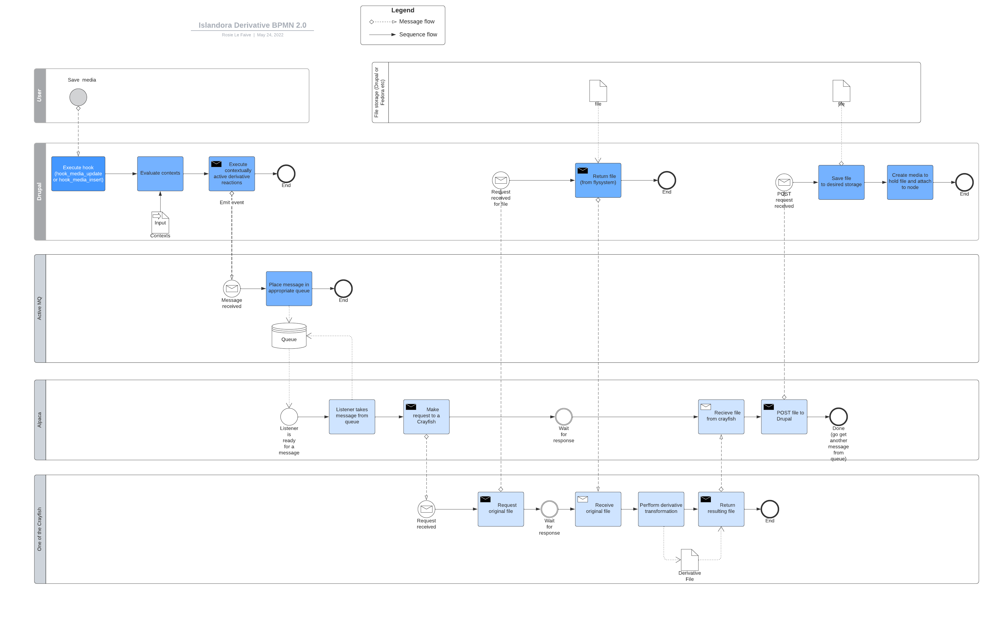

# Derivatives

Derivatives are files, usually generated automatically from a source file, which may be useful to the repository. 
Examples of derivatives include:

- smaller or compressed __service files__
- __thumbnails__ or poster images for display
- __preservation files__ in open file formats
- files containing __technical metadata__ about a file.

## Derivatives are Actions in Drupal

Derivative configuration is stored using Drupal's Actions.  
This means that all derivative configuration, such as
parameters dictating the derivative
size and quality can be edited by a repository administrator
in the Drupal GUI under Manage > System > Actions.

As Actions, they can be executed on nodes manually using Views Bulk Operations.
They can also be configured to run automatically on media save thanks to Islandora's additions to the 
Drupal [Contexts] module.

## Derivatives have Types

When creating a new Derivative Action, there are a number of flavours of
derivative "types" available. All derivative Actions fall into one of 
these types. 

| Derivative type name | machine name | Supplying module | Expected Microservice (software) | 
| --- | --- | --- | --- |
| Generate a Technical metadata derivative | `generate_fits_derivative` | Islandora FITS (roblib) | Crayfits (FITS) |
| Generate a audio derivative	| `generate_audio_derivative` | Islandora Audio | Homarus (FFmpeg) | 
| Generate a video derivative	| `generate_video_derivative` | Islandora Video | Homarus (FFmpeg) |
| Generate an image derivative	| `generate_image_derivative` | Islandora Image | Houdini (ImageMagick) |
| Get OCR from image	|`generate_ocr_derivative`| Islandora Text Extraction | Hypercube (tesseract/pdftotext)

!!! note "Multi-file media"
    The Multi-file media architecture stores derivatives as extra files on a media, rather
    than as entire media attached to a node. The derivatives types available for multi-file media are the 
    ones marked as "for Media Attachment" e.g. "Generate an Image Derivative for Media Attachment". 

## Derivatives are created by microservices ("Crayfish")

In Islandora, we generate derivatives using microservices, which are small web applications
that do a single task. Each microservice takes the name of a file as well as some parameters. It 
runs an executable and returns a transformed file, which can be loaded back into the repository. The microservices
 in Islandora stack are:

| Repository | Microservice name | executable|
|---|---|---|
| Crayfish | Homarus | FFmpeg |
| Crayfish | Houdini | ImageMagick |
| Crayfish | Hypercube | tesseract/pdftotext |
| Crayfits | Crayfits | FITS |

## Derivatives are created using an external queue

To send orders to the microservices, Islandora sends messages 
to an external queue, from which the microservices process the jobs as they are able. 
This is a robust system that can "operate at scale", i.e. can large handle batches of uploads
without slowing down the repository.

The queue system used by Islandora is ActiveMQ, and the listeners are part of ["Alpaca"](../alpaca/alpaca-technical-stack.md)

## Derivative Swimlane Diagram

The following diagram shows the flow of derivative generation from start to finish. A user saves a Media in Drupal, which may trigger Drupal to emit a derivative event to a queue, which is read by Alpaca and sent to a microservice. The microservice gets the original file and makes a transformation, returning the derivative file to Alpaca, which sends it back to Drupal to become a Drupal Media.

