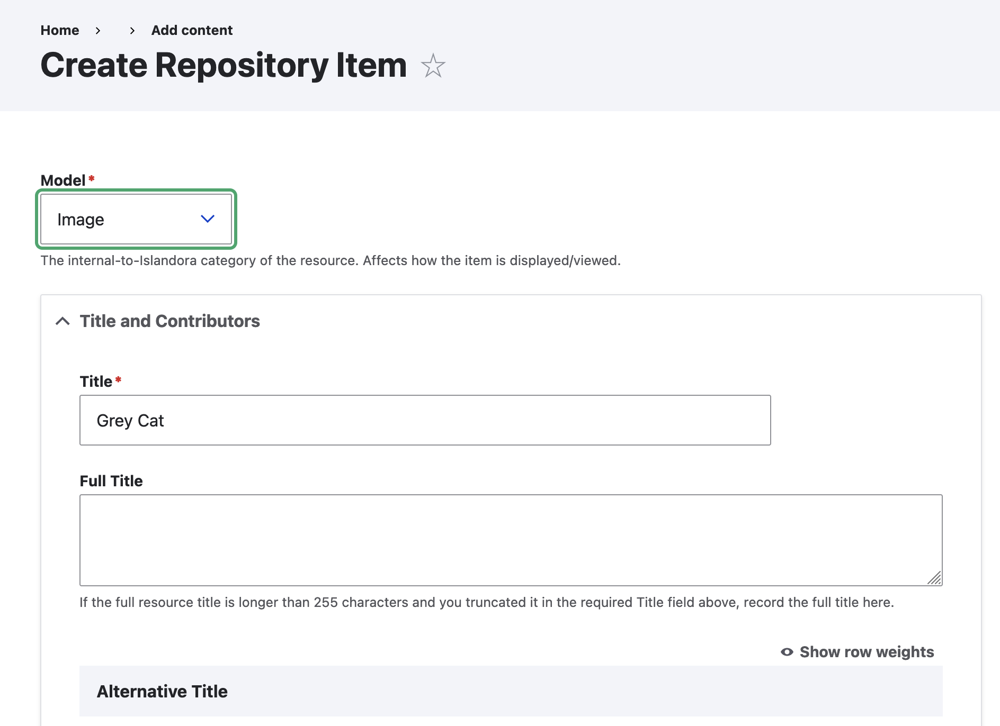
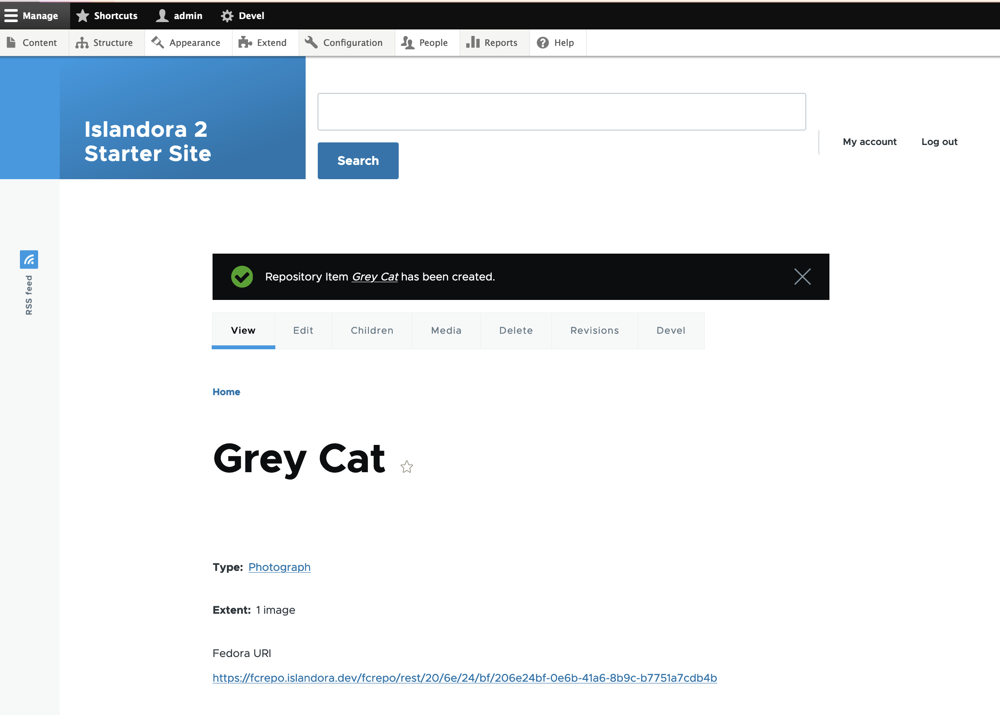
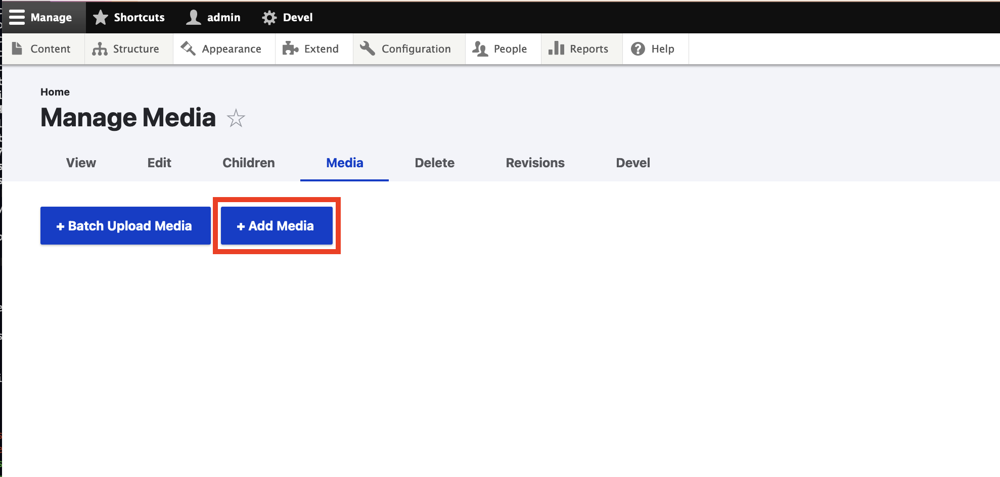
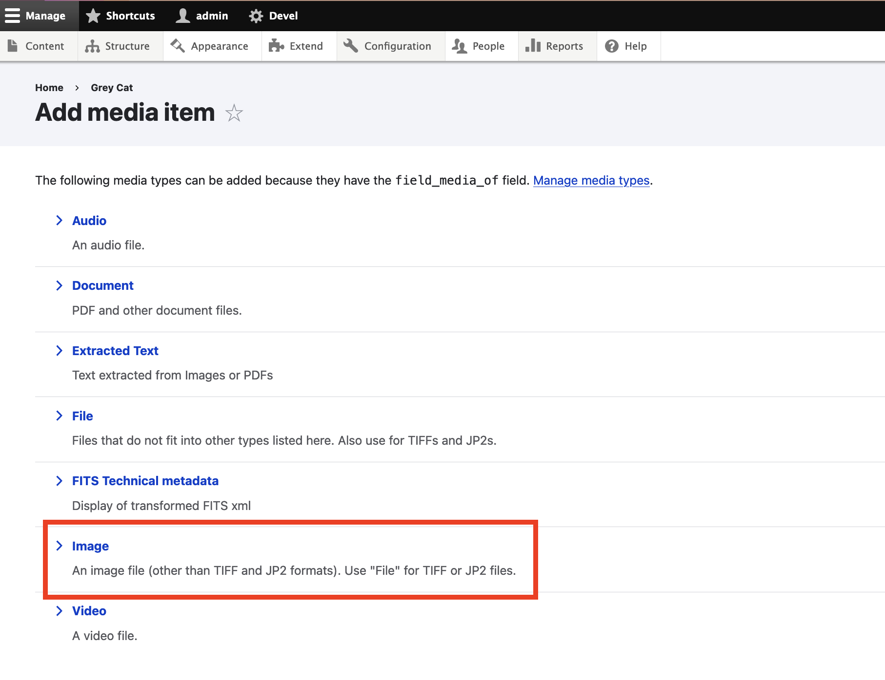
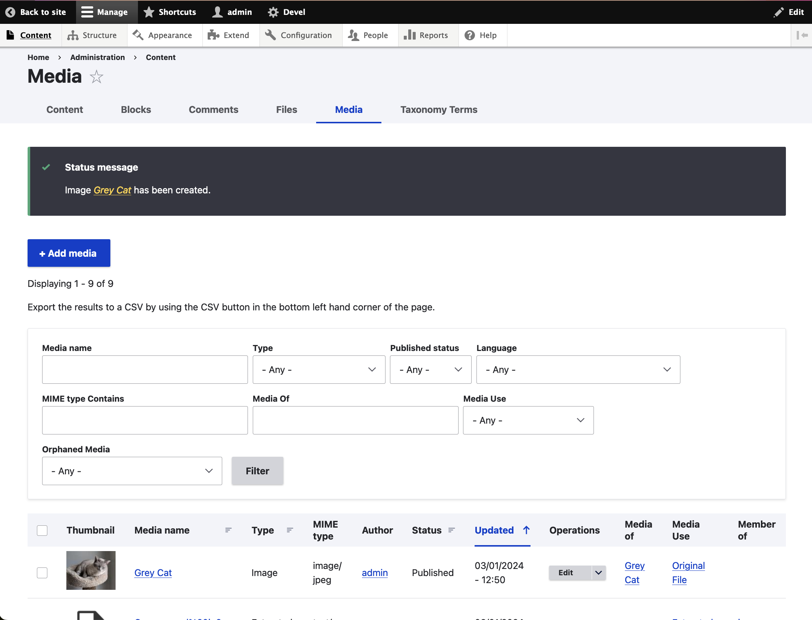
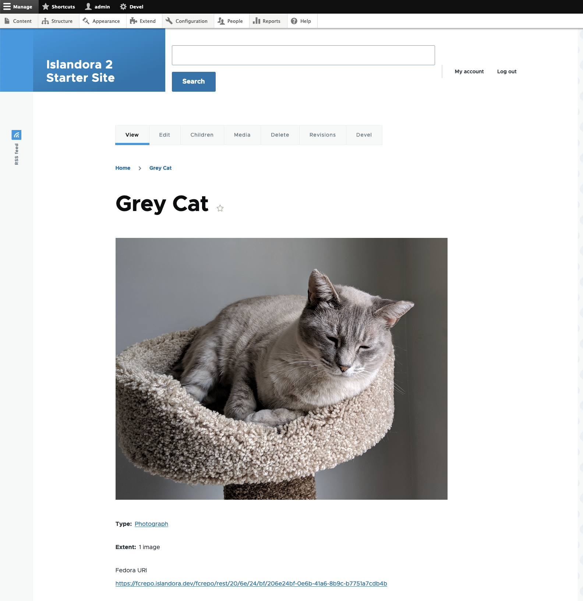
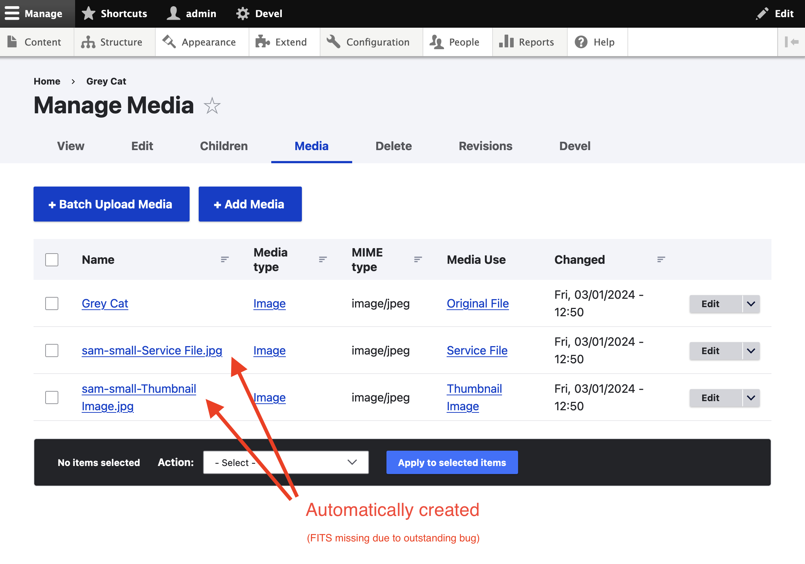

## Overview

This tutorial will walk you through adding a piece of digital content (an image and some metadata) into an Islandora repository, creating an Islandora [Resource Node](../user-documentation/content-models.md).
At the end, you will have metadata in a Drupal node, a file stored in Fedora, and derivatives automatically created.

!!! Tip "Video version available"
    The material in this tutorial is presented in our video, [Adding Content](https://youtu.be/G52is7iFkG4).

## Tools

For this tutorial you will need an instance of [Islandora Starter Site](https://github.com/Islandora/islandora-starter-site). You can also use the online sandbox or one of the [sandbox VMs](https://drive.google.com/drive/folders/1rmaIX-Rw5VmCQrkE8_nQTKLX82rVSL0z?usp=sharing).

[Online Sandbox](http://sandbox.islandora.ca)

[login credentials for online sandbox](https://github.com/Islandora/documentation/wiki/Sandbox.Islandora.ca-online-credentials)

## Step 1: Create an Islandora Node

To add content to Islandora, start by creating a node. When logged in to Drupal as an administrator, navigate with the top menu bar to **Manage** >> **Content** >> **Add content** or click on **Add content** under the _Tools_ menu.

Next, select a content type that is configured with Islandora behaviours. In the Islandora Starter Site, there is an Islandora content type. It is called **Repository Item**.

At the top of the form, the _Model_ field is a mandatory Islandora field. Select **Image** from the _Model_ drop box. This will enable image display behaviours, and cause image derivatives to be generated once we upload a file.

The rest of the form contains a large number of metadata fields, grouped into collapsible sections. Fill out the _Title_ (mandatory) and whichever other fields are applicable to you.

!!! Error "Keep it simple"
    For this tutorial, do not attempt to fill out any fields with an autocomplete symbol - a small circle at the right-hand-side of the text box. 
<!-- We should really include creating/adding a name here or in another tutorial!! It's a source of immediate confusion and frustration! -->

Then, click **Save**. You have now created a node, and since it is of an Islandora content type, we call it a "resource node."

The new node page displays, with the title, any metadata that we entered, and a _Fedora URI_ which you can click on to see if this new node has been synced into Fedora (this only works if you have permission to access Fedora). Congratulations, you have created a resource node!

## Step 2: Upload an Original File

Alas, your node has no files. To upload a file, click on the node's _Media_ tab.

!!! islandora "Concept: Media tab"
    The "Media" tab shows Media that we say "belong to" or are "media of" that node. The idea of media "belonging to" nodes, and the "Media" tab, are part of Islandora but not part of standard Drupal.

The Media tab shows nothing listed, because this node has no files. So click on **Add Media**. You will be taken to a list of media types to choose from.

We want to add a jpg image, so click on _Image_. You are now presented with a form to create a media.

!!! warning "Images vs TIFFs"
    Drupal considers any type of image that can be viewed natively in the browser as an _Image_.
    For other image types that require special viewers, such as TIFFs, you would have to choose
    _File_. [Learn more about Media in Islandora](../user-documentation/media.md).

This form contains fields for metadata about the file, including "technical metadata". There are three important
parts of the form:

1. _Name_, which identifies this media.
1. _Image_, the file to upload, and its alternative text.
1. _Media Use_, describing what this file is in the context of its resource node. To trigger derivative
generation, select the checkbox for _Original File_.

With the mandatory fields filled out (do not edit the "_Media of_" field), click **Save**, and a new Media will be created attached to your resource node. You will land on the administrator's list of Media (i.e. all media on your site, not just those attached to the resource node), and the new media object you created is at the top of the list.

Select the Media you just created, and you will see a page containing that Media's information and a rendering of the image that you uploaded.

<!-- We should maybe mention that it is living in Fedora? but why doesn't the Fedora URI show up?  -->

<!-- No longer visible since we disable "Standalone media URL", and those fields are not visible in the form.
Scroll down to see metadata below the uploaded image. The _MIME type_, _File size_, _Width_, and _Height_ were automatically populated when the file was uploaded. The value under _Media of_ is a link back to the resource node.

-->

## Step 3: Verify derivatives were created

Now return to the node you created, and you will see the image along with its (minimal) descriptive metadata. The image you are viewing is not the one you uploaded, but a lower-resolution service file that was created and stored in the Drupal public filesystem.

<!-- should increase the amount of descriptive metadata to make this make more sense -->

If you open the node's _Media_ tab, you should see new Media have been added - these are derivatives have been created automatically, including a service file, a thumbnail, and a FITS technical metadata file.

You now have an Islandora resource node, which is a special case of a Drupal node, and it has Media attached to it including an Original File, Thumbnail, Service File, and FITS Technical Metadata file.

## Learn More

- Drupal documentation on [Nodes](https://www.drupal.org/docs/7/nodes-content-types-and-fields/about-nodes)
- Drupal documentation on [Media](https://www.drupal.org/docs/8/core/modules/media).
<!-- include Nodes, Media, etc. once they make sense to follow this tutorial. -->
