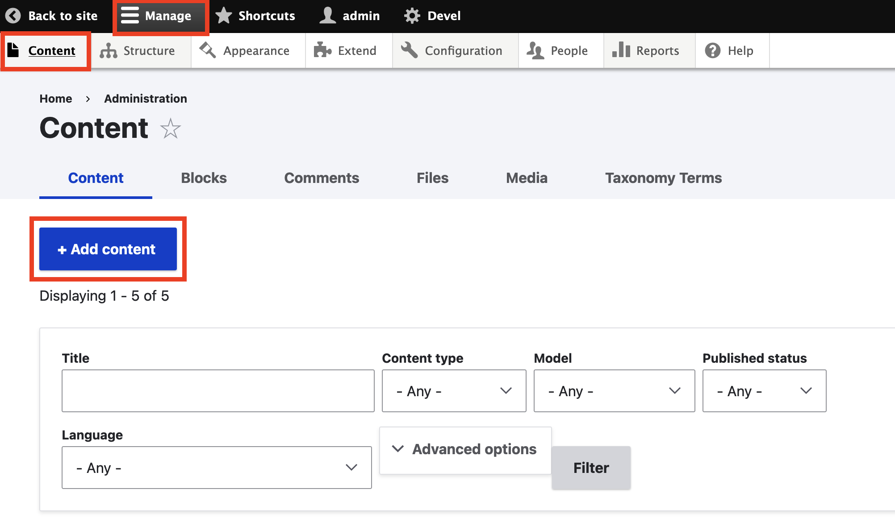
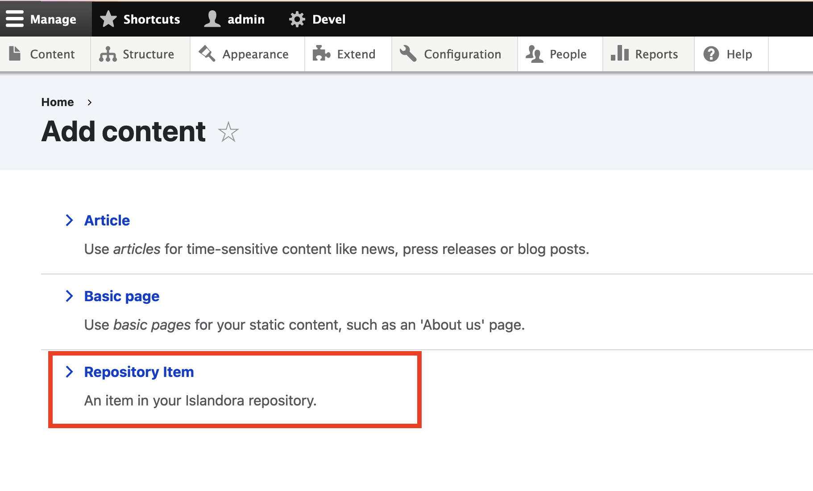
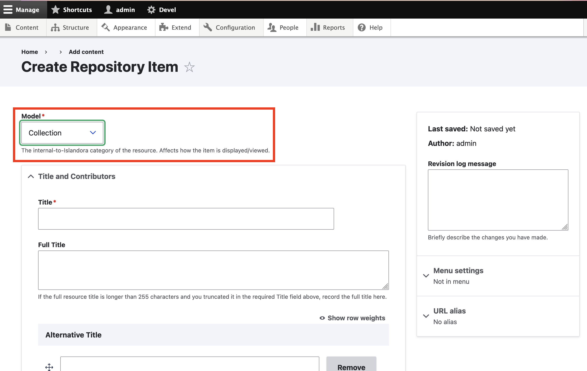
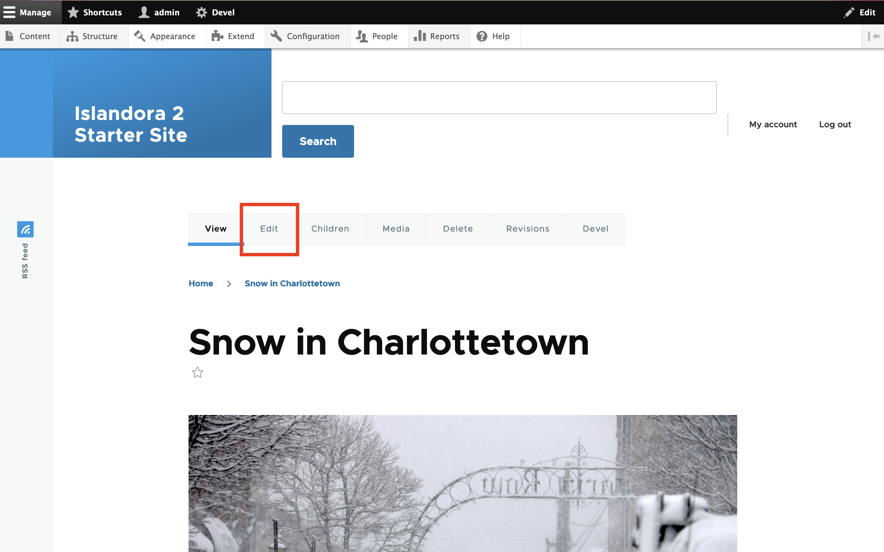
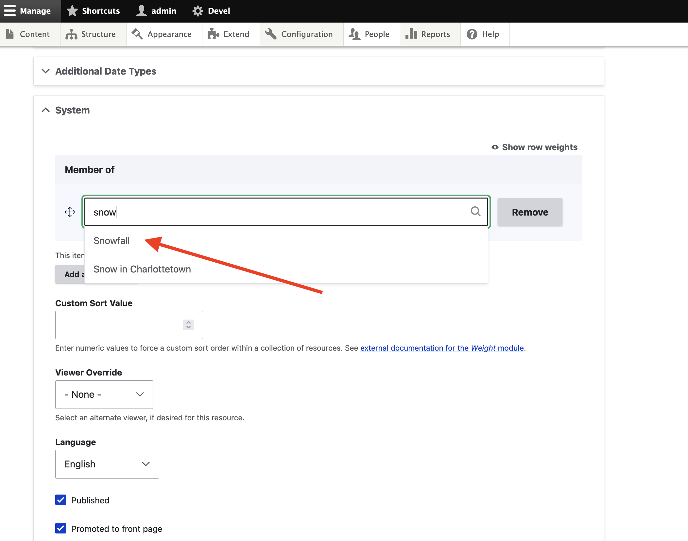
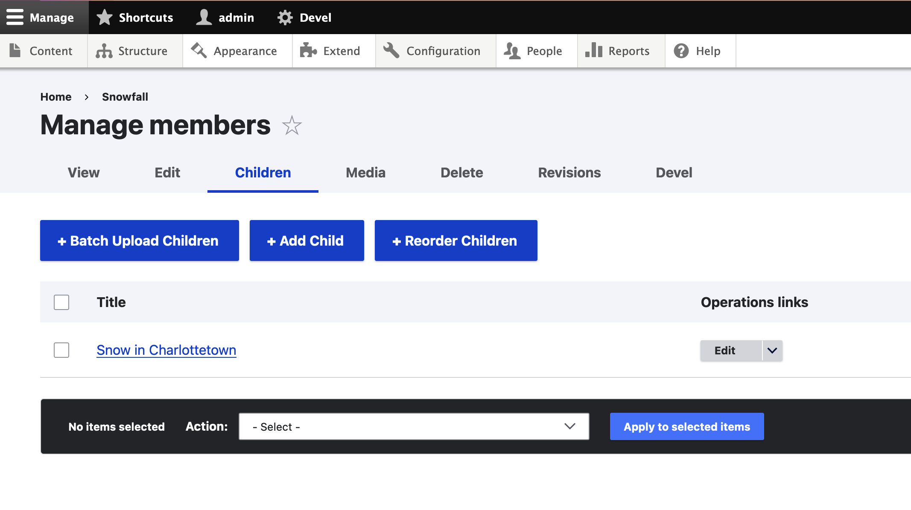
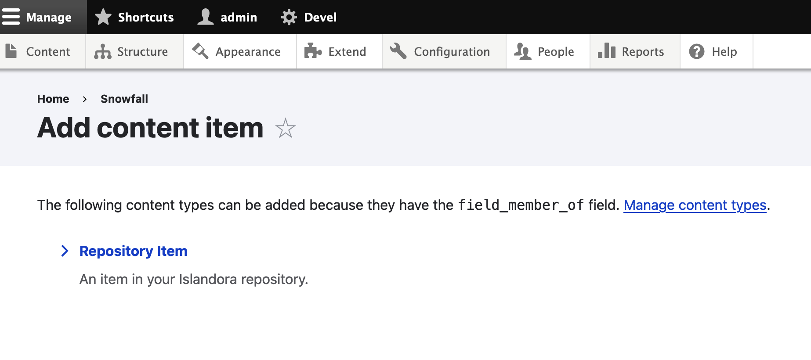

# How to create and add to a Collection

This how-to demonstrates creating a collection and adding items to it in the Islandora Starter Site. For more about collections, see [Concept: Collection](../concepts/collection.md).

## Introduction

In the Islandora Starter Site, nodes that have "Collection" in their Model field will show a view of their member ("child") objects. A member is any object that is "Member of" that object, and can be added via the "Children" tab. This is the mechanism in the Islandora Starter Site, and your individual instances may vary.

!!! Warning "Collections and Deleting"
    Collections and their members are independent of each other,
    and removing something from a collection does not delete it.
    **Similarly, deleting a collection does not delete its members.**

## Creating a Collection

When logged in, click _Manage_ > _Content_ on the admin toolbar. Then, click on _Add content_.

Then click on 'Repository Item' to give your collection the default metadata profile for Islandora.

Fill out the form.

At the top of the form, select "Collection" from the _Model_ dropdown list.

When done filling out the form, click _Save_.

The collection has been created. Now let's add some members to this collection.

## Add Existing Items to a Collection

To populate a collection with existing items, return to any existing content and click on its Edit tab. This brings up the form for this item.

Scroll down to the bottom of the form to find the System section. In the _Member of_ field, start typing in the name of the collection this item should belong to. Select the name of the collection you want from the autocomplete. It is important that you select it from the dropdown, not just type in the correct title, because selecting it causes the node id to appear beside the title and allows Drupal to create a relationship.

The correct collection is now selected.  Click _Save_ when ready.

To confirm, return to the collection and verify the new item appears in the collection's list of members.

## Add a New Item as a Member of a Collection

To create an item and add it as a member to a collection in one step, visit a collection and click on its _Children_ tab. From the
_Children_ tab, you can manage the members of a collection and perform actions on them.

Click on the _+Add Child_ button, and then select _Repository Item_ as your new item's Content Type.  Only content types that
have the `field_member_of` field will be available from this list.

You are taken to the creation form for a Repository Item, but if you scroll down to the "System" section, you should see the widget
for "Member Of" is already filled out for you with the appropriate collection.

Click 'Save' at the end of the form to create the new item and add it as a member of the collection.

!!! Tip "Islandora Quick Lessons"
    Learn more with this video on [Making a Collection](https://youtu.be/9jFVAE6l4so).
